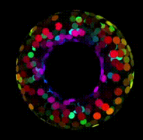

# Self synchronization with locality and closed boundaries

<!-- the single source of truth of this file is the GitHub repo readme.md. -->

self-synchronizes into

## Intro
Nicky Case made a demo of self-synchronizing fireflies: [https://ncase.me/fireflies/](https://ncase.me/fireflies/)  

I want to add two things:
- **Locality**. Light speed is finite. 
- **Closed boundaries**. Here I have tried: 
  - Sphere surface. 
  - Torus surface. 

You can run the demo with Processing 3. Source code is at [https://github.com/Daniel-Chin/self-sync-w-finite-light-speed-and-closed-boundary](https://github.com/Daniel-Chin/self-sync-w-finite-light-speed-and-closed-boundary)  

## Motivation
In computer networks, when TCP end hosts do congestion control, they need to synchronize with other hosts to modulate the queue length in gateways. Ideally, the globe should pulsate as a whole. But when information travels at finite speed, how can the hosts synchronize? 

I thought the torus surface would be easier. Imagine uni-directional waves. For the sphere though, I can't imagine any stable pattern, so the Earth's internet may have some trouble finding equilibrium. However, experiments showed the sphere actually did better than the torus. 

## If you are on GitHub
You should switch to the [documentation blog](https://inspiring-yonath-a67980.netlify.app/#/blog/self_sync_locality), which has embedded YouTube videos. 

## Light speed `c` is infinite
i.e. there is non-local interaction. 

<iframe width="560" height="315" src="https://www.youtube.com/embed/81-LluMBauI" title="YouTube video player" frameborder="0" allow="accelerometer; autoplay; clipboard-write; encrypted-media; gyroscope; picture-in-picture" allowfullscreen></iframe>

Here, both shapes quickly converges to stable patterns. 

## `c = 10`
Slower convergence to stable patterns. 

<iframe width="560" height="315" src="https://www.youtube.com/embed/l0UPaAzJ7XA" title="YouTube video player" frameborder="0" allow="accelerometer; autoplay; clipboard-write; encrypted-media; gyroscope; picture-in-picture" allowfullscreen></iframe>

## `c = 5.7`
<iframe width="560" height="315" src="https://www.youtube.com/embed/b1LsofPvB9k" title="YouTube video player" frameborder="0" allow="accelerometer; autoplay; clipboard-write; encrypted-media; gyroscope; picture-in-picture" allowfullscreen></iframe>

## `c = 1.9`
<iframe width="560" height="315" src="https://www.youtube.com/embed/DGJJaoAskdU" title="YouTube video player" frameborder="0" allow="accelerometer; autoplay; clipboard-write; encrypted-media; gyroscope; picture-in-picture" allowfullscreen></iframe>

## Ring world
They sometimes converge to a uni-directional looping wave, but sometimes converge to one-source-one-drain waves. 

<iframe width="560" height="315" src="https://www.youtube.com/embed/g0QWBbU7EzE" title="YouTube video player" frameborder="0" allow="accelerometer; autoplay; clipboard-write; encrypted-media; gyroscope; picture-in-picture" allowfullscreen></iframe>

<iframe width="560" height="315" src="https://www.youtube.com/embed/cmysjYysUx4" title="YouTube video player" frameborder="0" allow="accelerometer; autoplay; clipboard-write; encrypted-media; gyroscope; picture-in-picture" allowfullscreen></iframe>

## Cheating
I can "plant" 20% nodes whose phase I initialized according to a desired wave pattern. They turn out to converge to the planted pattern. 

<iframe width="560" height="315" src="https://www.youtube.com/embed/fvP19ilBz18" title="YouTube video player" frameborder="0" allow="accelerometer; autoplay; clipboard-write; encrypted-media; gyroscope; picture-in-picture" allowfullscreen></iframe>

<iframe width="560" height="315" src="https://www.youtube.com/embed/EyKUOhay4Mk" title="YouTube video player" frameborder="0" allow="accelerometer; autoplay; clipboard-write; encrypted-media; gyroscope; picture-in-picture" allowfullscreen></iframe>

## Some longer runs
<iframe width="560" height="315" src="https://www.youtube.com/embed/Hma5KYbkzsA" title="YouTube video player" frameborder="0" allow="accelerometer; autoplay; clipboard-write; encrypted-media; gyroscope; picture-in-picture" allowfullscreen></iframe>

<iframe width="560" height="315" src="https://www.youtube.com/embed/PPUW6RZ9vzg" title="YouTube video player" frameborder="0" allow="accelerometer; autoplay; clipboard-write; encrypted-media; gyroscope; picture-in-picture" allowfullscreen></iframe>
